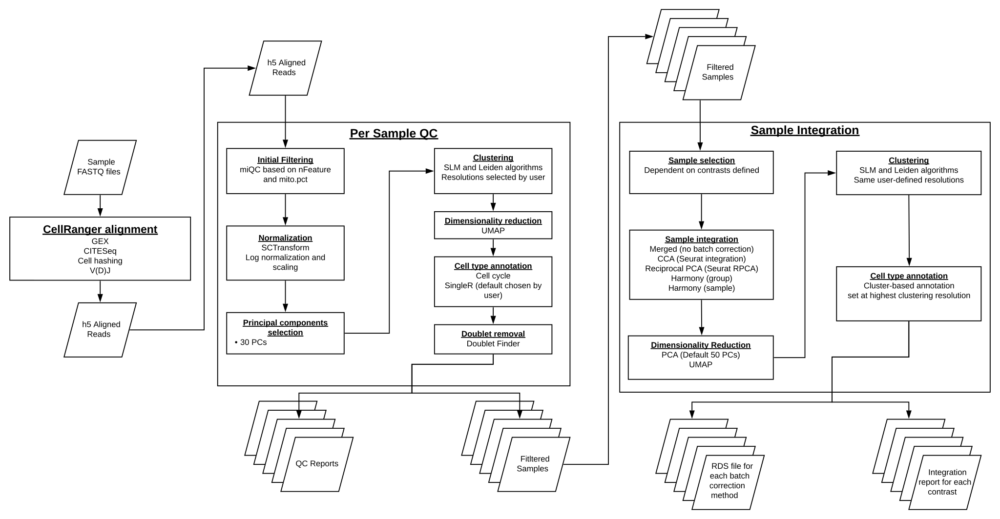

# SINCLAIR - **SIN**gle **C**el**L** **A**nalys**I**s **R**esource


An open-source, reproducible solution for multiple single cell next-generation modalities


## Overview
The pipeline is designed to run single cell RNA Sequencing analysis on a variety of sample types. It is designed to run on [Biowulf](https://hpc.nih.gov/) using [Nextflow](https://www.nextflow.io/).

For comments/suggestions/advice please reach out to [Samantha Chill](mailto:samantha.sevilla@nih.gov) or [Nathan Wong](mailto:nathan.wong@nih.gov).

For detailed documentation on running the pipeline view the [documentation](https://CCBR.github.io/TechDev_scRNASeq_Dev2023) page.

### Table of contents
- [SINCLAIR - **SIN**gle **C**el**L** **A**nalys**I**s **R**esource](#sinclair---single-cell-analysis-resource)
  - [Table of Contents](#table-of-contents)
  - [1. Introduction](#1-introduction)
  - [2. Overview](#2-overview)
  - [GitHub Structure](#github-structure)

### 1. Introduction

### 2. Overview

 <sup>**Overview of Single Cell RNASeq Gene Expression Pipeline**</sup>

### GitHub Structure

```
├── assets 
│   └── input_manifest.csv
├── bin
│   └── check_samplesheet.py
├── conf
│   ├── base.config
│   ├── modules.config
│   └── test.config
├── docs
│   ├── analysis
│   │   ├── background.md
│   │   ├── conclusions.md
│   │   ├── plan.md
│   │   ├── resources.md
│   │   └── results.md
│   ├── contributions.md
│   └── index.md
├── fullWorkflow_202304
│   ├── cellRangerCalls
│   │   ├── basic_gex.bash
│   │   ├── gex_citeseq
│   │   │   ├── features.csv
│   │   │   ├── gex_citeseq.bash
│   │   │   └── sample_library.csv
│   │   └── gex_citeseq_cellhashing
│   │       ├── features.csv
│   │       ├── gex_citeseq_cellhashing.bash
│   │       └── sample_library.csv
│   ├── groups.tab
│   ├── markdownFiles
│   │   ├── integrationReport.R
│   │   ├── integrationReports.Rmd
│   │   ├── scRNA_QC_202209.Rmd
│   │   ├── scrna_QC.R
│   │   └── scRNA_QC.Rmd
│   ├── velocyto
│   │   ├── runPerSample.R
│   │   ├── runVelo.bash
│   │   └── runVelo.py
│   └── workflow
│       ├── scripts
│       │   ├── harmony.R
│       │   ├── hashing.R
│       │   ├── integrateBatches.R
│       │   ├── rpca.R
│       │   ├── runCellRanger.py
│       │   ├── runSeurat.py
│       │   └── scRNA.R
│       └── Snakefile
├── LICENSE
├── main.nf
├── mkdocs.yml
├── modules
│   └── local
│       ├── cellranger_count_gex.nf
│       ├── module1.nf
│       ├── module2.nf
│       └── samplesheet_check.nf
├── nextflow.config
├── README.md
├── subworkflows
│   └── input_check.nf
├── test_dir
│   ├── gex_samplesheet.csv
│   └── README.md
├── test.sh
└── workflows
    └── gex.nf
```
