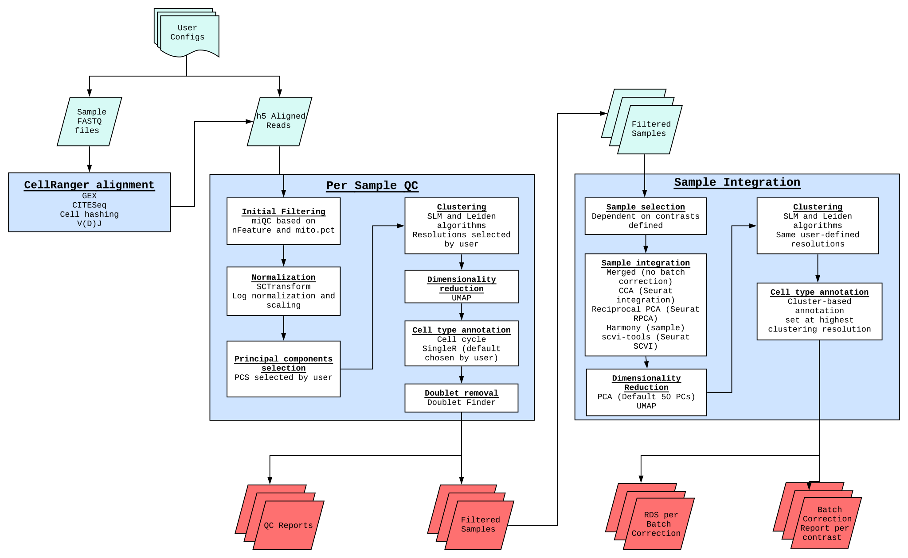

# SINCLAIR

**SIN**gle **C**el**L** **A**nalys**I**s **R**esource

[](https://github.com/CCBR/SINCLAIR/actions/workflows/build.yml)
[](https://ccbr.github.io/SINCLAIR/)
[](https://doi.org/10.5281/zenodo.15283503)
[](https://github.com/CCBR/SINCLAIR/releases/latest)

View the documentation here: <https://ccbr.github.io/SINCLAIR/>

### Introduction

SINCLAIR was developed by the CCR Collaborative Bioinformatics Resource as an open-source, reproducible solution for multiple single cell next-generation modalities. It has been developed solely on [Biowulf](https://hpc.nih.gov/) using [Nextflow](https://www.nextflow.io/).

### Overview

The pipeline currently begins with either sample FASTQ file or h5 Aligned reads, completing per sample quality control, and per-contrast integration. Quality control reports are generated, as are per-contrast integration reports.

 <sup>**Overview of Single Cell RNASeq Gene Expression Pipeline**</sup>

### Quickstart

SINCLAIR is available on biowulf with the ccbrpipeliner module as of release 8. You can load it on an interactive node with:

```sh
module load ccbrpipeliner/8
```

```sh
sinclair --help
sinclair --version
```

#### Example usage

##### 1. Initialize your project

--output is optional and defaults to your current working directory.

```sh
sinclair init --output /path/to/output/dir
```
##### 2. Update the config files as needed

can change whether cellranger is deployed, species, names of manifest files (default locations listed below)

In `/path/to/output/dir`:

- `assets/params.yml`
- `assets/input_manifest.csv`
- `assets/contrast_manifest.csv`

##### 3. Run the pipeline

A) preview without executing
```sh
sinclair run -preview --output /path/to/output/dir -params-file assets/params.yml
```

B) local run
```sh
sinclair run --output /path/to/output/dir -params-file assets/params.yml
```

C) submit to slurm
```sh
sinclair run --mode slurm --output /path/to/output/dir -params-file assets/params.yml
```

## Help & Contributing

Come across a **bug**? Open an [issue](https://github.com/CCBR/SINCLAIR/issues) and include a minimal reproducible example.

Have a **question**? Ask it in [discussions](https://github.com/CCBR/SINCLAIR/discussions).

Want to **contribute** to this project? Check out the [contributing guidelines](.github/CONTRIBUTING.md).

**General Inquiries and Collaboration:** Please contact the CCBR Pipeliner team at [CCBR_Pipeliner@mail.nih.gov](mailto:CCBR_Pipeliner@mail.nih.gov).
