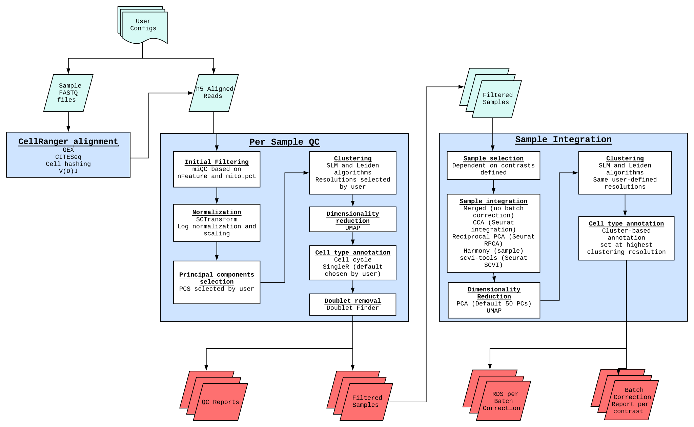

# SINCLAIR

**SIN**gle **C**el**L** **A**nalys**I**s **R**esource

[](https://github.com/CCBR/SINCLAIR/actions/workflows/build.yml)
[](https://ccbr.github.io/SINCLAIR/)
[](https://github.com/CCBR/SINCLAIR/releases/latest)

## Table of contents

- [1. Introduction](#1-Introduction)
- [2. Overview](#2-Overview)
- [3. Documentation](#3-Documentation)
- [4. Feedback](#4-Feedback)

### 1. Introduction

The [SINCLAIR - **SIN**gle **C**el**L** **A**nalys**I**s **R**esource](#sinclair---single-cell-analysis-resource) was developed by the CCR Collaborative Bioinformatics Resource as an open-source, reproducible solution for multiple single cell next-generation modalities. It has been developed solely on [Biowulf](https://hpc.nih.gov/) using [Nextflow](https://www.nextflow.io/).

### 2. Overview

The pipeline currently begins with either sample FASTQ file or h5 Aligned reads, completing per sample quality control, and per-contrast integration. Quality control reports are generated, as are per-contrast integration reports.

 <sup>**Overview of Single Cell RNASeq Gene Expression Pipeline**</sup>

### 3. Basic Deployment

Usage

```
sinclair --help
sinclair --version
```

Example workflow

```
# 1) run initialization
# --output is optional and defaults to your current working directory.
sinclair init --output /path/to/output/dir

# 2) update the config files as needed
## can change whether cellranger is deployed, species, names of manifest files (default locations listed below)
/path/to/output/dir/nextflow.config
/path/to/output/dir/assets/contrast_manifest.csv /path/to/output/dir/assets/input_manifest.csv

# 3) deploy the pipeline
## A) STUBRUN
sinclair run -stub -entry GEX --output /path/to/output/dir

## B) local run
sinclair run -entry GEX --output /path/to/output/dir

## C) submit to slurm
sinclair run --mode slurm -entry GEX --output /path/to/output/dir

# 4) OPTIONAL resume
sinclair run --mode slurm -entry GEX -resume --output /path/to/output/dir
```

### 4. Detailed Documentation

Please view the repositories [documentation](https://symmetrical-adventure-ovjq9gl.pages.github.io/) for full details on deploying the pipeline, features, testing, and expected outputs.

## Help & Contributing

Come across a **bug**? Open an [issue](https://github.com/CCBR/SINCLAIR/issues) and include a minimal reproducible example.

Have a **question**? Ask it in [discussions](https://github.com/CCBR/SINCLAIR/discussions).

Want to **contribute** to this project? Check out the [contributing guidelines](.github/CONTRIBUTING.md).

**General Inquiries and Collaboration:** Please contact the CCBR Pipeliner team at [CCBR_Pipeliner@mail.nih.gov](mailto:CCBR_Pipeliner@mail.nih.gov).
