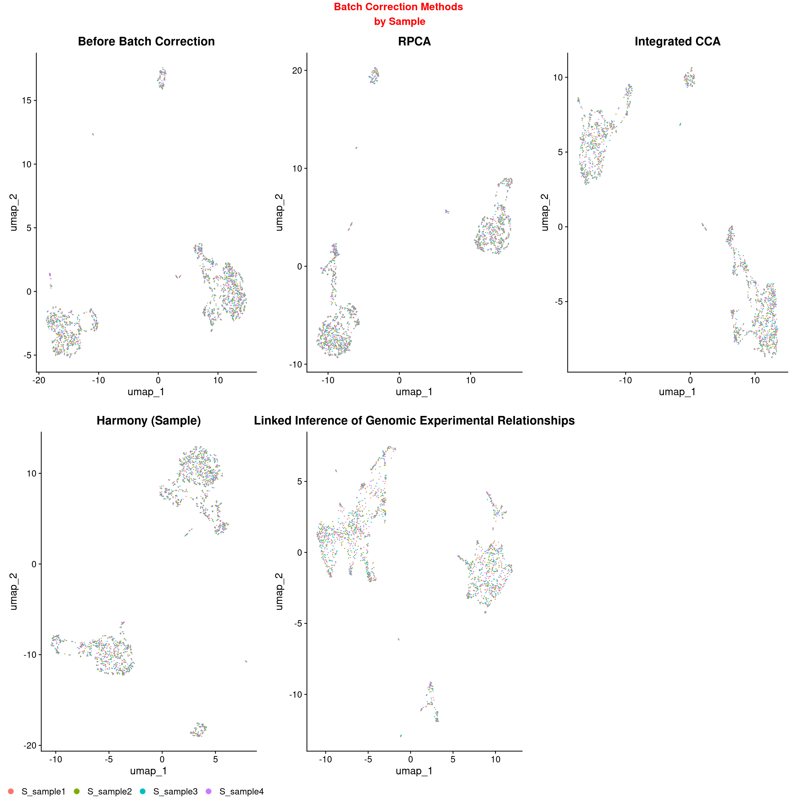
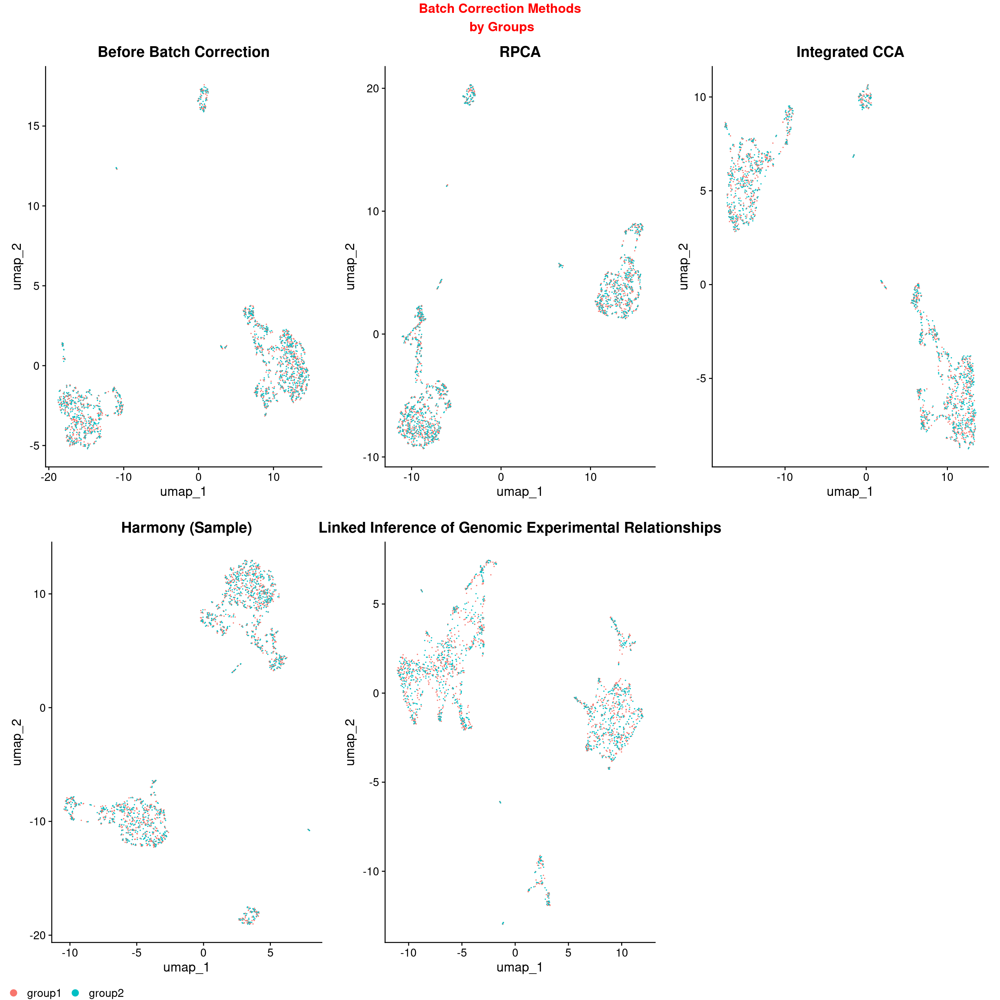
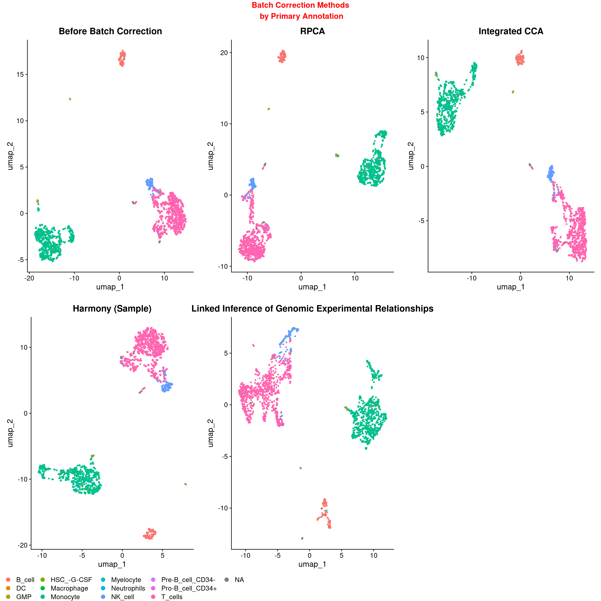
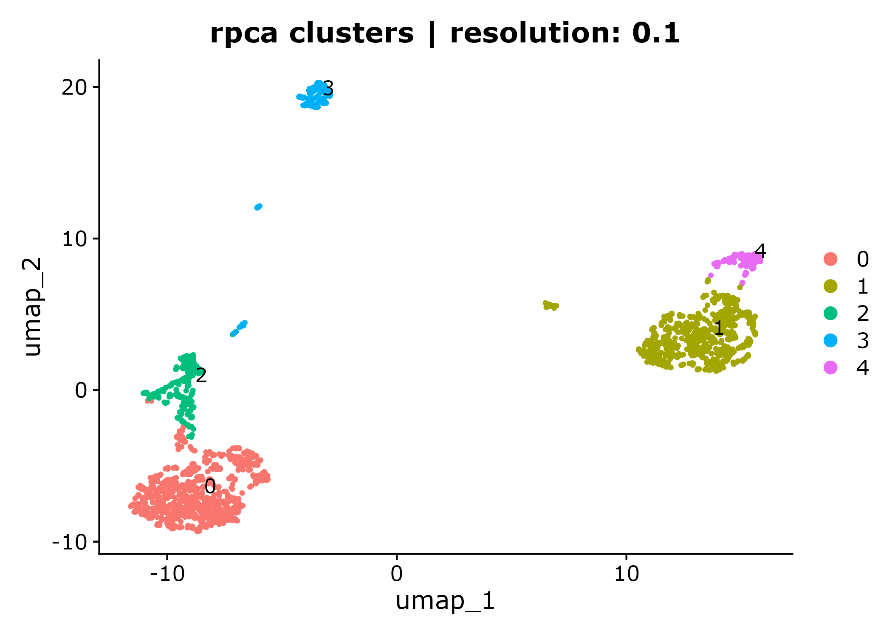
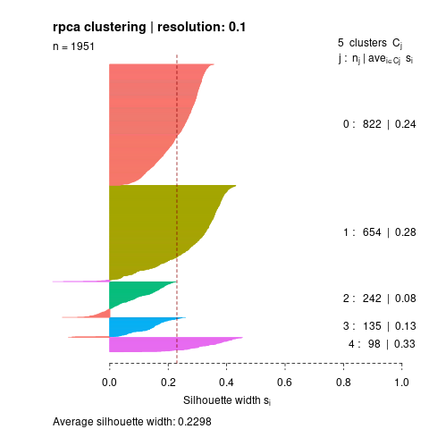

# Setting up a test run

## The Basics

A test run of the pipeline can be initiated through the following command:

```
sinclair run --mode slurm -profile test
```

This profile will automatically use the `test` sample and contrasts manifests, which are the default designs present in the `assets` directory.

```
assets/input_manifest.csv

masterID,uniqueID,groupID,dataType,input_dir
WB_Lysis_1,sample1,group1,gex,/data/CCBR_Pipeliner/testdata/SINCLAIR/WB_Lysis_Granulocytes_3p_Introns_8kCells_fastqs/sample1
WB_Lysis_1,sample2,group1,gex,/data/CCBR_Pipeliner/testdata/SINCLAIR/WB_Lysis_Granulocytes_3p_Introns_8kCells_fastqs/sample2
WB_Lysis_2,sample3,group2,gex,/data/CCBR_Pipeliner/testdata/SINCLAIR/WB_Lysis_Granulocytes_3p_Introns_8kCells_fastqs/sample3
WB_Lysis_2,sample4,group2,gex,/data/CCBR_Pipeliner/testdata/SINCLAIR/WB_Lysis_Granulocytes_3p_Introns_8kCells_fastqs/sample4
WB_Lysis_3,sample5,group3,gex,/data/CCBR_Pipeliner/testdata/SINCLAIR/WB_Lysis_Granulocytes_3p_Introns_8kCells_fastqs/sample5
```

```
assets/contrast_manifest.csv

contrast1,contrast2,contrast3
group1,group2
group1,group2,group3
```

This run will have 5 samples, and will run 2 separate sets of contrasts. The first contrast, `group1-group2`, will contain samples 1 through 4, while the second contrast, `group1-group2-group3`, will contain all 5 samples, as indicated by the `groupID` variable in the `sample_manifest.csv`. The contrasts are primarily used for sample filtering, in the event of multiple contrasts that are not fully inclusive of all the data points.

Upon launching the test run, the following output will be generated in the command line window:

```
[<user>@cn0034 output_directory]$ sinclair run -profile test
[2025:08:04 16:12:26] --------------------
[2025:08:04 16:12:26] | Output Directory |
[2025:08:04 16:12:26] --------------------

/path/to/output/directory
[2025:08:04 16:12:26] --------------------
[2025:08:04 16:12:26] | Pipeline Preview |
[2025:08:04 16:12:26] --------------------

bash -c "module load nextflow && nextflow run /data/CCBR_Pipeliner/Pipelines/SINCLAIR/v0.3/sinclair/main.nf -profile biowulf,slurm,test -resume  -preview"
[+] Loading java 23.0.2  ...
[+] Loading singularity  4.2.2  on cn0034
[+] Loading nextflow  25.04.2
Nextflow 25.04.6 is available - Please consider updating your version to it

 N E X T F L O W   ~  version 25.04.2

WARN: It appears you have never run this project before -- Option `-resume` is ignored
Launching `/data/CCBR_Pipeliner/Pipelines/SINCLAIR/v0.3/sinclair/main.nf` [angry_williams] DSL2 - revision: c921f3551d

SINCLAIR 0.3.3

===================================
cmd line     : nextflow run /data/CCBR_Pipeliner/Pipelines/SINCLAIR/v0.3/sinclair/main.nf -profile biowulf,slurm,test -resume -preview
start time   : 2025-08-04T16:12:30.921987287-04:00
NF outdir    : /path/to/output/directory/output/tests

Input/output options
  input                     : /data/CCBR_Pipeliner/Pipelines/SINCLAIR/v0.3/sinclair/assets/input_manifest.csv
  contrast                  : /data/CCBR_Pipeliner/Pipelines/SINCLAIR/v0.3/sinclair/assets/contrast_manifest.csv
  outdir                    : /vf/users/wongnw/sandbox/sinclair_pipe8_202508/output/tests

Main options
  species                   : hg38
  qc_filtering              : miqc
  genome_dir                : /data/CCBR_Pipeliner/db/PipeDB/cellranger_ref/hg38

Institutional config options
  config_profile_name       : Test profile starting from fastq files
  config_profile_description: Minimal test dataset to check pipeline function
  config_profile_contact    : staff@hpc.nih.gov
  config_profile_url        : https://hpc.nih.gov/apps/nextflow.html

Generic options
  tracedir                  : /path/to/output/directory/output/pipeline_info
  max_memory                : 224 GB
  max_cpus                  : 32
  max_time                  : 72 h

Core Nextflow options
  runName                   : angry_williams
  containerEngine           : singularity
  launchDir                 : /path/to/output/directory
  workDir                   : /path/to/output/directory/work
  projectDir                : /data/CCBR_Pipeliner/Pipelines/SINCLAIR/v0.3/sinclair
  userName                  : wongnw
  profile                   : biowulf,slurm,test
  configFiles               : /data/CCBR_Pipeliner/Pipelines/SINCLAIR/v0.3/sinclair/nextflow.config, /path/to/output/directory/nextflow.config

!! Only displaying parameters that differ from the pipeline defaults !!
------------------------------------------------------
[-        ] process > PREPROCESS_EXQC:INPUT_CHECK_GEX:SAMPLESHEET_CHECK -
[-        ] process > PREPROCESS_EXQC:CELLRANGER_COUNT                  -
[-        ] process > GEX_EXQC:SEURAT_PREPROCESS                        -
[-        ] process > GEX_EXQC:SEURAT_MERGE                             -
[-        ] process > GEX_EXQC:BATCH_CORRECT_HARMONY                    -
[-        ] process > GEX_EXQC:BATCH_CORRECT_RPCA                       -
[-        ] process > GEX_EXQC:BATCH_CORRECT_CCA                        -
[-        ] process > GEX_EXQC:BATCH_CORRECT_LIGER                      -
[-        ] process > GEX_EXQC:BATCH_CORRECT_INTEGRATION                -

[2025:08:04 16:12:33] -------------------
[2025:08:04 16:12:33] | Slurm batch job |
[2025:08:04 16:12:33] -------------------

sbatch submit_slurm.sh
[2025:08:04 16:12:33] --------------------
[2025:08:04 16:12:33] | Nextflow command |
[2025:08:04 16:12:33] --------------------

nextflow run /data/CCBR_Pipeliner/Pipelines/SINCLAIR/v0.3/sinclair/main.nf -profile biowulf,slurm,test -resume
64401687

```

## About the data

**_Overview_**: The original dataset was downloaded from 10x Genomics in FASTQ format and unpacked from WB_Lysis_Granulocytes_3p_Introns_8kCells_fastqs.tar. This dataset was taken from a single sample and run on two sequencing lanes.

**TUTORIAL:** <https://support.10xgenomics.com/single-cell-gene-expression/software/pipelines/latest/tutorials/neutrophils>

**SOURCE:** <https://www.10xgenomics.com/resources/datasets/whole-blood-rbc-lysis-for-pbmcs-neutrophils-granulocytes-3-3-1-standard>

**Species:** _Homo sapiens_

**Genome Reference:** Human genome GRCh38

**Data Type:** Single-cell gene expression (GEX)

**Sequencing Platform:** 10x Genomics Chromium, 3' v3.1 chemistry

**Analysis Software** Cell Ranger v6.1.0

**Donor Information:** healthy female

**Isolation protocol:** CG000392 RevA: Isolation of Leukocytes, Bone Marrow and Peripheral Blood Mononuclear Cells for Single Cell RNA Sequencing - Whole Blood Lysis for Granuloctyes track.

Whole transcriptome/Gene Expression libraries were generated as described in the Chromium Next GEM Single Cell 3' Reagent Kits v3.1 (Dual Index) User Guide (CG000204 Rev D).

## Sample Design and Arrangement

The two lanes have been treated as separate replicates. Each replicate was then subsampled to produce leaner datasets for testing.

### _WB_1_

- WB_Lysis_Granulocytes_3p_Introns_8kCells_S1_L001_I1_001.fastq.gz
- WB_Lysis_Granulocytes_3p_Introns_8kCells_S1_L001_I2_001.fastq.gz
- WB_Lysis_Granulocytes_3p_Introns_8kCells_S1_L001_R1_001.fastq.gz
- WB_Lysis_Granulocytes_3p_Introns_8kCells_S1_L001_R2_001.fastq.gz

### _WB_2_

- WB_Lysis_Granulocytes_3p_Introns_8kCells_S1_L002_I1_001.fastq.gz
- WB_Lysis_Granulocytes_3p_Introns_8kCells_S1_L002_I2_001.fastq.gz
- WB_Lysis_Granulocytes_3p_Introns_8kCells_S1_L002_R1_001.fastq.gz
- WB_Lysis_Granulocytes_3p_Introns_8kCells_S1_L002_R2_001.fastq.gz

### WB_3 and WB_4 - Simulated Replicates

To simulate technical and biological replicates, and to assess the effects of clustering, batch correction, and downstream steps (e.g. Differential Gene Expression), WB_3 and WB_4 samples were copied from WB_1 and WB_2 respectively.

- WB_1 --> WB_3
- WB_2 --> WB_4

### Subsampling Details

Each group was further downsampled to make the dataset lightweight and suitable for rapid testing.

- WB_1 --> sample1,sample2
- WB_2 --> sample3,sample4
- WB_3 --> sample5

## Expected Output

The SINCLAIR test run will produce the following structure in the directory:

```
.
├── assets
│   └── <files>
├── conf
│   └── <files>
├── log
│   └── <files>
├── nextflow.config
├── results
│   ├── pipeline_info
│   │   ├── execution_report_2025-07-21_14-58-51.html
│   │   ├── execution_report_2025-07-21_15-00-18.html
│   │   ├── execution_timeline_2025-07-21_14-58-51.html
│   │   ├── execution_timeline_2025-07-21_15-00-18.html
│   │   ├── execution_trace_2025-07-21_14-58-34.txt
│   │   ├── execution_trace_2025-07-21_14-58-51.txt
│   │   ├── execution_trace_2025-07-21_15-00-18.txt
│   │   ├── pipeline_dag_2025-07-21_14-58-51.svg
│   │   └── pipeline_dag_2025-07-21_15-00-18.svg
│   └── tests
│       ├── batch_correct
│       │   ├── group1-group2_batch_correction_cca.html
│       │   ├── group1-group2_batch_correction_cca.rds
│       │   ├── group1-group2_batch_correction_harmony.html
│       │   ├── group1-group2_batch_correction_harmony.rds
│       │   ├── group1-group2_batch_correction_integration.html
│       │   ├── group1-group2_batch_correction_liger.html
│       │   ├── group1-group2_batch_correction_liger.rds
│       │   ├── group1-group2_batch_correction_rpca.html
│       │   ├── group1-group2_batch_correction_rpca.rds
│       │   ├── group1-group2-group3_batch_correction_cca.html
│       │   ├── group1-group2-group3_batch_correction_cca.rds
│       │   ├── group1-group2-group3_batch_correction_harmony.html
│       │   ├── group1-group2-group3_batch_correction_harmony.rds
│       │   ├── group1-group2-group3_batch_correction_integration.html
│       │   ├── group1-group2-group3_batch_correction_liger.html
│       │   ├── group1-group2-group3_batch_correction_liger.rds
│       │   ├── group1-group2-group3_batch_correction_rpca.html
│       │   └── group1-group2-group3_batch_correction_rpca.rds
│       ├── cellranger_counts
│       │   ├── sample1
│       │   │   └── outs
│       │   │       └── filtered_feature_bc_matrix.h5
│       │   ├── sample2
│       │   │   └── outs
│       │   │       └── filtered_feature_bc_matrix.h5
│       │   ├── sample3
│       │   │   └── outs
│       │   │       └── filtered_feature_bc_matrix.h5
│       │   ├── sample4
│       │   │   └── outs
│       │   │       └── filtered_feature_bc_matrix.h5
│       │   └── sample5
│       │       └── outs
│       │           └── filtered_feature_bc_matrix.h5
│       ├── samplesheets
│       │   ├── project_contrast_samplesheet.csv
│       │   ├── project_gex_samplesheet.csv
│       │   └── project_groups_samplesheet.csv
│       └── seurat
│           ├── merge
│           │   ├── group1-group2-group3_seurat_merged.html
│           │   ├── group1-group2-group3_seurat_merged.rds
│           │   ├── group1-group2_seurat_merged.html
│           │   └── group1-group2_seurat_merged.rds
│           └── preprocess
│               ├── sample1_seurat_preprocess.html
│               ├── sample1_seurat_preprocess.rds
│               ├── sample2_seurat_preprocess.html
│               ├── sample2_seurat_preprocess.rds
│               ├── sample3_seurat_preprocess.html
│               ├── sample3_seurat_preprocess.rds
│               ├── sample4_seurat_preprocess.html
│               ├── sample4_seurat_preprocess.rds
│               ├── sample5_seurat_preprocess.html
│               └── sample5_seurat_preprocess.rds
├── submit_slurm.sh
└── work
    └── <files>

```

The relevant results are found the `test` subdirectory. For live data, the directories will all exist directly within the `results` directory. If debugging is required, all intermediate files will be in the `work` directory.

### Pre-processed files

**Directory**: `cellranger_counts`

The default `test` profile aligns the samples to the reference genome using the [CellRanger software](https://www.10xgenomics.com/support/software/cell-ranger/latest/analysis/running-pipelines/cr-gex-count#cr-count-gex). The [results](https://www.10xgenomics.com/support/software/cell-ranger/latest/analysis/outputs/cr-outputs-gex-overview) of the CellRanger count function are extensive, but for the purpose of data management, the only files saved are the filtered feature count matrix. These can be found in the `cellranger_counts` directory, and have the extension `.h5`, indicating that these files are compressed in [HDF5](https://www.10xgenomics.com/support/software/cell-ranger/latest/analysis/outputs/cr-outputs-h5-matrices) format.

### Processed and filtered sample files

**Directory:** `seurat/preprocess`

Each sample undergoes an initial filtering and pre-processing step. Each sample undergoes the following quality controls and annotations:

- Basic statistics: Each sample has preliminary QC statistics determined, such as the number of reads per cell, number of unique gene sequences per cell, and mitochondrial read count fraction.
- Low cell quality filtering: Runs on the basis of [miQC](https://www.bioconductor.org/packages/release/bioc/html/miQC.html), which filters cells based on the ratio of reads to mitochondrial fraction.
- Preliminary UMAP creation: Generates a UMAP dimensional reduction for visualization
- Initial cell type annotation: Uses the [SingleR](https://bioconductor.org/packages/release/bioc/html/SingleR.html) tool to annotate cells independently against species-specific databases.
- Doublet identification and removal: Uses the [DoubletFinder](https://github.com/chris-mcginnis-ucsf/DoubletFinder) tool to identify and remove doublets.

For each sample, this step produces a `.rds.` (R data structure) file, which can be imported into an R environment using the `readRDS("xxx.rds")` function for further analysis, and a `.html` quality control

### Combined and batch corrected files

**Directories:** `seurat/merge` and `batch_correct`

#### Combined sample file

When combining samples, the two processes, as labeled by the Seurat team, are _merge_ and _integrate_. In more common parlance, these terms are closer to _sample combination_ and _batch correction_. The combined sample file is in the `seurat/merge` directory, and for each contrast run, contains all the cells of the combined samples. The cell identities are automatically appended with a numerical identifier to ensure uniqueness across samples. Here, the cell counts for each sample are all present, with no additional modifications beyond principal components calculation and UMAP projection.

The combined sample file for each contrast (i.e. group1-group2 and group1-group2-group3), as designated in `contrast_manifest.csv`, is present as `seurat/merge/<contrast>_seurat_merged.rds`. A `.html` run report for each contrast is present as well.

#### Batch corrected files

The batch corrected files are in the `batch_correct` directory. Each of the following batch correction methods are run for each contrast:

- [Canonical Correlation Analysis (CCA)](https://satijalab.org/seurat/articles/integration_introduction): Uses the Seurat `integrate` function

- [Harmony](https://cran.r-project.org/web/packages/harmony/index.html): Uses the Harmony correction method

- [LIGER](https://github.com/welch-lab/liger): Linked Inference of Genomic Experimental Relationships

- [Reciprocal PCA (RPCA)](https://satijalab.org/seurat/articles/integration_rpca): Uses RPCA from Seurat

As with the `merged` directory, the batch corrected files are generated for each contrast, namely the `.rds` files and the `.html` output files

#### Sample combination and batch correction report

For comparative purposes, an integration report is included for each contrast. For the 4-sample 2-group contrast, the file is available for viewing [here](./test-outputs/group1_group_2_batch_correction_integration.html), while the 5-sample 3-group contrast is available [here](./test-outputs/group1-group2-group3_batch_correction_integration.html). Each report contains the sections described below; example images are collected from the 4-sample 2-group contrast.

##### UMAP plots

Each batch correction method has undergone principal component analysis and uniform manifold approximation and projection (UMAP) for visualization. These plots can be colored by different metadata categories. This report includes coloring by sample, group identity, and preliminary cell type annotation.



_Cells colored by sample_



_Cells colored by group identity_



_Cells colored by annotation_

The tab for cell annotation also includes a table of cell counts matching the annotation used.

##### Clustering and silhouette scores

Clustering is used to potentially identify and classify similar cells, based on their "distance" from each other (i.e. similarity in gene expression and principal components). For this process, we have utilized the clustering method called the slow local moving algorithm, as made available in Seurat. This method uses a parameter called `resolution` to indicate how wide of a net to cast when clustering cells. Smaller resolutions will produce fewer and larger clusters, with the risk being that some genuinely disparate clusters might be bundled together. Comparatively, larger resolutions will produce more abundant smaller clusters, with the tradeoff being that some clusters may be unnecessarily separated. As such, the balance needs to be struck where the clusters are reasonably well-defined without breaking up clusters internally.



_Example cluster plot for RPCA at resolution 0.1_

For each cluster resolution created, the report will produce silhouette scores to provide a categorical evaluation of the quality of the clustering. The silhouette score is a metric that evaluates the similarity of cells within each cluster and compares the overall similarity to cells outside the cluster. Each cluster receives a score, and a positive average silhouette score indicates that the clusters are more desirable due to being more condensed and self-contained.



_Example silhouette score plot for RPCA clustering at resolution 0.1_
